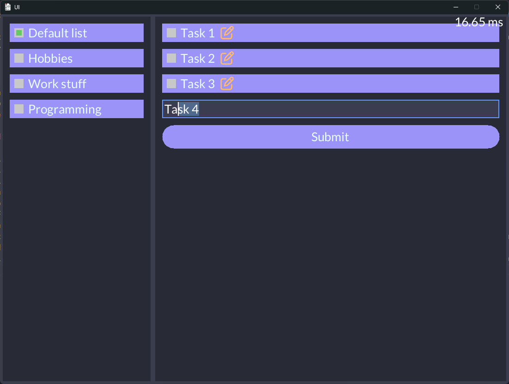

# To-Do List in C

A simple graphical todo app implemented completely from scratch by writing pixels to a large byte array and blitting it to the screen.

The main motivation for this app is to finally have an excuse to make a UI library - something I've wanted to do for a long time. The todo part isn't that interesting, it's just the hello world of GUIs. Think of it as a litmus test for the library.

  

## What's included

* Basic skeleton of a full-fledged immediate mode UI library with a simple offline auto-layout algorithm
* Basic abstraction for building widgets as blocks that provide all needed interaction states like hovering, clicked, and release - so building more complex widgets should be straightforward
* Basic text editing utility that supports the common ctrl, home, end commands in addition to selection, so supporting more complex text editing widgets should be easy
* Minimal graphics library providing a set of graphics primitives
* Animation utility to handle dispatching multiple animations with custom easing functions and updating them every frame
* Simple built-in profiler to monitor hot paths
* All allocations are done using a single frame arena that gets reset every frame
* Loading TTF fonts with UTF-8 support, plus a simple embedded debug font for when you don't want to depend on anything
* Bunch of helpful math and general utilities to make your life easier

## Dependencies

* **GLFW** - handles windowing and input
* **stb_ds** - basic dynamic arrays and hashmaps
* **stb_truetype** - loading TTF fonts 
